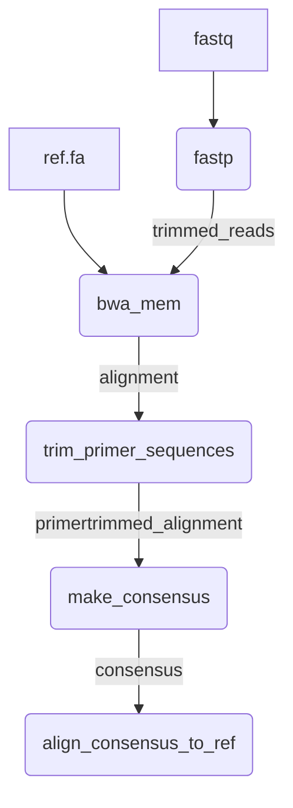

# amplicon-consensus

```mermaid
flowchart TD
  ref[ref.fa]
  fastq[fastq]
  fastq --> fastp(fastp)
  ref --> bwa(bwa_mem)
  fastp -- trimmed_reads --> bwa
  bwa -- alignment --> trim_primer_seqs(trim_primer_sequences)
  trim_primer_seqs -- primertrimmed_alignment --> make_consensus(make_consensus)
  make_consensus -- consensus --> align_consensus_to_ref(align_consensus_to_ref)
```