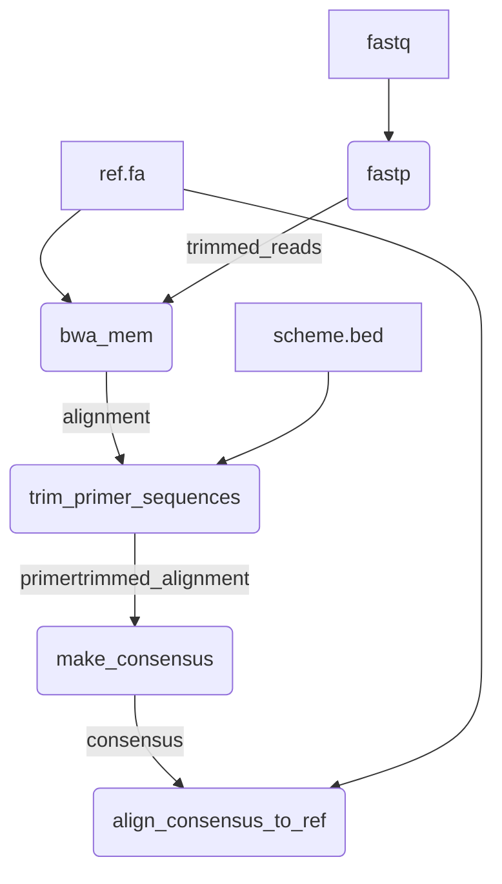
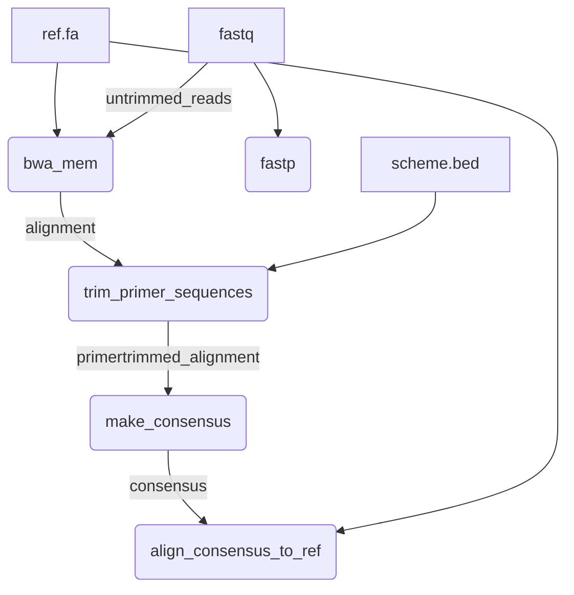

# amplicon-consensus

A simple pipeline for generating a consensus sequence from amplicon-based libraries.

This pipeline is intended as a simple and generic tool for exploring and assessing amplicon-based library preparations. It is not intended to provide final outputs for any specific genomic assay.

This pipeline allows users to quickly and simply assess:

- Depth of coverage across the genome, or specific target region(s)
- Quality of the alignment, including estimates of sequence error rates
- Similarity between generated consensus sequence and a reference.



## Usage

The following command can be used to run the pipeline:

```
nextflow run BCCDC-PHL/amplicon-consensus \
  -profile conda \
  --cache ~/.conda/envs \
  --fastq_input /path/to/fastq_files \
  --ref /path/to/ref.fa \
  --bed /path/to/primer_scheme.bed \
  --outdir /path/to/output_dir
```

By default, reads will be trimmed by fastp prior to alignment. To align the untrimmed reads instead, use the `--align_untrimmed_reads` parameter:

```
nextflow run BCCDC-PHL/amplicon-consensus \
  -profile conda \
  --cache ~/.conda/envs \
  --fastq_input /path/to/fastq_files \
  --ref /path/to/ref.fa \
  --bed /path/to/primer_scheme.bed \
  --align_untrimmed_reads \
  --outdir /path/to/output_dir
```

If this option is used, the pipeline will proceed as follows, using the original untrimmed reads as input for the bwa alignment process:




## Inputs


## Outputs

### Coverage Plot
